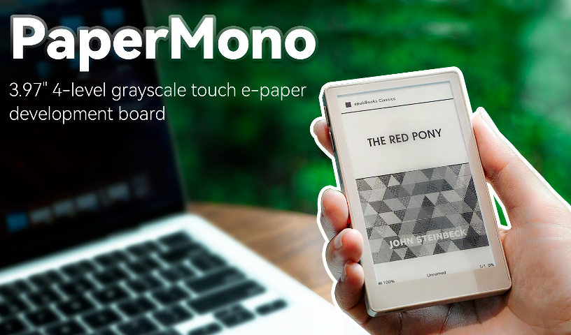
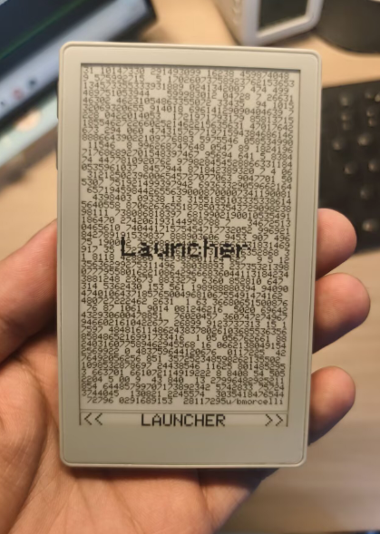
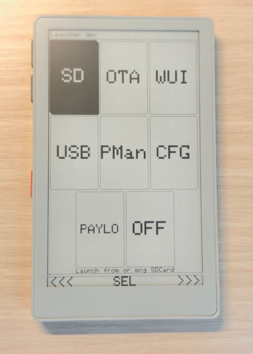
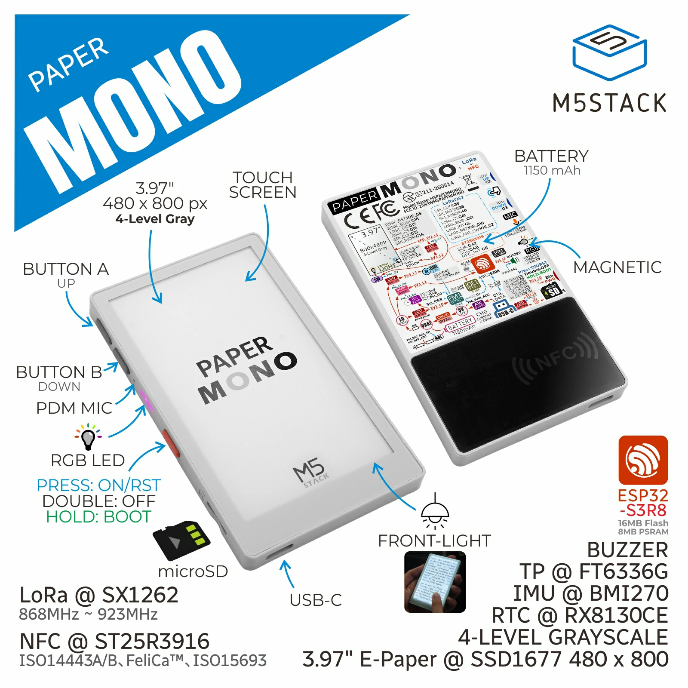
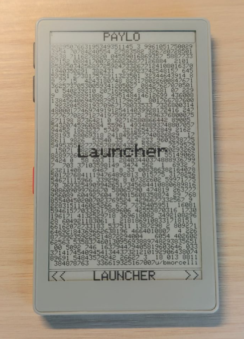
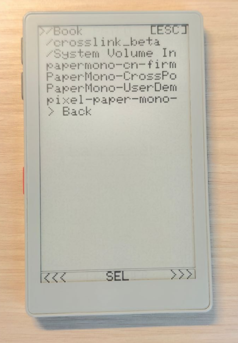
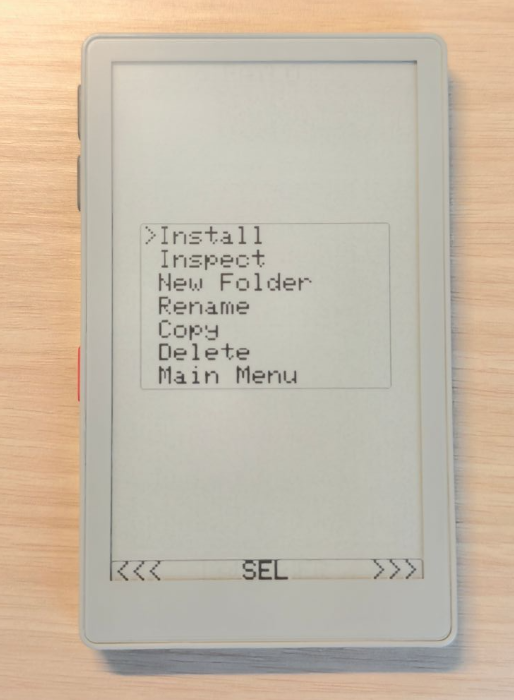

# PaperMono-Launcher

<table>
  <tr>
    <td align="center" valign="middle">
      
    </td>
    <td align="center" valign="middle">
      
    </td>
    <td align="center" valign="middle">
      
    </td>
  </tr>
  <tr>
    <td align="center"><sub>M5Stack PaperMono</sub></td>
    <td align="center"><sub>PaperMono-Launcher on real hardware</sub></td>
    <td align="center"><sub>Launcher main interface</sub></td>
  </tr>
</table>

<p align="center">
  <sub>
    M5Stack PaperMono · PaperMono-Launcher on real hardware · Launcher main interface
  </sub>
</p>

PaperMono-Launcher is a hardware-validated Launcher implementation for the
M5Stack PaperMono, maintained as a stable and usable PaperMono firmware
launcher with E-Ink UX optimizations, firmware management, payload boot,
and reliable recovery support.

> This project was developed by adapting and extending the existing M5Stack
> PaperS3-oriented Launcher implementation from
> [bmorcelli/Launcher](https://github.com/bmorcelli/Launcher) for the PaperMono
> hardware platform.

**PaperMono Status: Hardware-validated / Stable Repository**

> The `main` branch of this repository is intended to represent the latest
> hardware-validated and usable PaperMono state.
>
> Experimental, unverified, or potentially unstable changes are kept outside
> the stable mainline and are only promoted here after build verification and
> real-device hardware validation.

This is **not official M5Stack firmware** and is **not the upstream Launcher repository**.
It is an independent PaperMono-focused derivative maintained by
[MingRZou](https://github.com/MingRZou).

---

## Project Origin

PaperMono-Launcher is based on the open-source
[bmorcelli/Launcher](https://github.com/bmorcelli/Launcher) project.

The initial PaperMono port was developed by adapting and extending Launcher's
existing M5Stack PaperS3-oriented implementation for the M5Stack PaperMono
hardware platform.

The implementation was subsequently extended and hardware-validated for
PaperMono-specific functionality, including:

- board initialization and bootstrap
- M5PM1 / M5IOE1 power and I/O management
- SSD1677 E-Ink display support
- touchscreen and button input
- SD card access
- front-light support
- Launcher UI and firmware browser
- firmware installation and verification
- payload boot
- explicit return to Launcher
- recovery and factory-safe fallback
- PaperMono-specific E-Ink refresh-policy optimization

The repository preserves the upstream Git history, authorship, contributor
history, and MIT license.

---

## Stable Repository Policy

This repository is maintained as the **stable PaperMono development line**.

The public `main` branch is not intended to serve as an experimental development
branch. Changes are promoted here only after the relevant verification stages
have been completed.

Depending on the change, validation may include:

- source and static verification
- production PlatformIO build verification
- firmware artifact verification
- real PaperMono hardware testing
- display, input, SD, and power regression checks
- firmware installation and payload boot verification
- return-to-Launcher and recovery verification

Experimental development and unverified builds are intentionally maintained
outside this stable repository.

The project will continue to evolve, but versions published through this
repository are intended to remain hardware-validated and usable.

---

## Hardware Platform

PaperMono-Launcher targets the
[M5Stack PaperMono](https://docs.m5stack.com/en/core/PaperMono) platform.

<p align="center">
  
</p>

PaperMono combines a 3.97-inch 480 × 800 E-Ink display based on the SSD1677
controller with an ESP32-S3 platform and integrated touch, SD card,
front-light, RTC, IMU, NFC, LoRa, and additional board-level peripherals.

PaperMono-Launcher focuses on providing a stable Launcher environment for this
hardware while preserving safe board initialization, display behavior,
firmware installation, payload boot, and recovery.

> The PaperMono product image and hardware overview image used in this README
> are sourced from the
> [official M5Stack PaperMono documentation](https://docs.m5stack.com/en/core/PaperMono).
> The Launcher interface photographs are from the real hardware used to validate
> this project.

---

## PaperMono Hardware-Validated Features

Current hardware-validated functionality includes:

- Native M5Stack PaperMono support
- Launcher startup and main UI
- Touch and button navigation
- SD card browsing
- Firmware browser
- Payload firmware installation
- Payload verification and boot selection
- Payload boot
- Explicit return to Launcher
- Recovery and factory-safe Launcher fallback
- Front-light control
- Hardware-validated E-Ink refresh policy
- Periodic full-refresh cleanup
- Standalone ESP32-S3 application installation
- Strict F1 embedded-app installation from eligible simple FullFlash wrappers

---

## Hardware-Validated Interface

The following photographs show the current stable PaperMono-Launcher
implementation running on real M5Stack PaperMono hardware.

<table>
  <tr>
    <td align="center" width="25%">
      
    </td>
    <td align="center" width="25%">
      
    </td>
    <td align="center" width="25%">
      
    </td>
    <td align="center" width="25%">
      
    </td>
  </tr>
  <tr>
    <td align="center"><sub>Boot Selector</sub></td>
    <td align="center"><sub>Launcher Main Menu</sub></td>
    <td align="center"><sub>SD / Firmware Browser</sub></td>
    <td align="center"><sub>Inspect / Install</sub></td>
  </tr>
</table>

The validated interaction flow is:

**Boot Selector → Launcher → Main Menu → SD / Firmware Browser → Inspect / Install → Verified Payload**

The boot selector allows the device to continue into the installed payload
firmware or explicitly return to Launcher.

From Launcher, firmware stored on the SD card can be browsed and inspected.
Firmware visibility does **not** imply installation eligibility: the Install
option is exposed only when the selected firmware satisfies the current
PaperMono compatibility and safety checks.

The images above are photographs of the actual PaperMono hardware used during
development and validation.

---

## E-Ink Refresh Optimization

PaperMono-Launcher includes a hardware-validated refresh-policy optimization
for the SSD1677 E-Ink display.

The original PaperMono port used a full display refresh for ordinary Launcher
interactions. This resulted in noticeable repeated flashing and long interaction
latency when:

- changing menu selections
- moving through SD card files
- navigating firmware options
- moving the browser cursor

The current stable implementation uses the existing PaperMono automatic refresh
manager instead.

Normal interaction behavior is now approximately:

```text
Initial display
    -> Full refresh

Normal interaction
    -> lighter partial refresh

Repeated partial refreshes
    -> periodic Full cleanup

After cleanup
    -> lighter refresh resumes
```
The current cleanup threshold remains conservative and hardware-validated.

### Hardware Result

On the tested PaperMono hardware:

- menu navigation no longer produces the previous repeated full-screen flashing
- SD/browser cursor movement is responsive
- no visible residual cursor ghosting was observed
- periodic full cleanup occurs normally
- normal lighter refresh resumes after cleanup
- no abnormal restart or heating was observed

A full E-Ink refresh during initial boot remains intentional and is not removed,
because the initial full baseline is part of the validated display behavior.

---

## Firmware Installation

PaperMono-Launcher uses a protected payload installation model.

Launcher itself remains in its dedicated factory application region, while
supported firmware is installed into the dedicated payload application
partition.

The installation path preserves:

- fixed payload destination containment
- source image validation
- ESP32-S3 target validation
- image size and bounds validation
- OTA write failure handling
- post-write `esp_image_verify()`
- boot selection only after successful verification
- Launcher recovery containment

---

## Firmware Compatibility

PaperMono-Launcher does **not** treat every `.bin` file as safe to install.

Firmware packages are intentionally classified conservatively.

| Firmware Type | Current Support | Notes |
| --- | --- | --- |
| ESP32-S3 standalone application image | ✅ Supported | Uses the protected payload installation path |
| Eligible F1 simple FullFlash wrapper | ✅ Supported | Only the embedded application is installed |
| Multi-partition / coupled FullFlash package | ❌ Unsupported | Additional assets, storage, APP, or filesystem dependencies may exist |
| Wrong-chip firmware | ❌ Rejected | PaperMono requires ESP32-S3 |
| Malformed / truncated image | ❌ Rejected | Structural validation failure |
| Oversized payload | ❌ Rejected | Must fit the protected payload partition |

### F1-v1 Installation Scope

F1-v1 support is intentionally narrow.

An eligible simple FullFlash wrapper may contain one valid embedded ESP32-S3
application together with only a minimal and non-populated supporting layout.


For an eligible F1 package, PaperMono-Launcher follows this model:

```text
FullFlash wrapper
    -> identify the embedded application
    -> validate the embedded ESP32-S3 application
    -> read only the embedded application byte range
    -> install it into the protected payload partition
    -> verify the installed payload
    -> select the payload for boot
```

PaperMono-Launcher does **not** install the complete FullFlash image.

The existing:

- bootloader
- partition table
- Launcher factory application
- recovery layout

remain protected.

### Unsupported F2 / Coupled FullFlash Packages

FullFlash packages containing or depending on structures such as:

- multiple application partitions
- populated `assets` partitions
- populated `storage` partitions
- required internal filesystems
- additional firmware-specific flash data

remain unsupported.

These packages are intentionally rejected rather than partially installed.

This distinction is important:

> **PaperMono-Launcher supports eligible embedded applications from strictly
> validated simple wrappers. It is not a generic FullFlash installer.**

---

## Hardware-Validated Milestones

Important stable milestones are preserved as Git tags.

### `personal-eink-v1`

PaperMono Auto E-Ink Refresh Policy v1.

Validated for:

- Launcher startup
- menu navigation
- SD/browser cursor movement
- periodic full-refresh cleanup
- ghosting behavior
- return to Launcher

### `personal-f1-install-v1`

Strict F1 embedded-app installation v1.

Validated with real PaperMono hardware for:

- F1 eligibility
- embedded application installation
- payload verification
- payload boot
- display
- touch
- buttons
- SD
- Wi-Fi
- return to Launcher
- existing standalone firmware installation regression
- continued rejection of unsupported coupled FullFlash packages

These tags represent hardware-validated development milestones.

A formal semantic-version release will be introduced separately when the
release packaging and distribution process is finalized.

---

## Screenshots

PaperMono-specific screenshots and hardware photos will be added here.

Planned examples include:

- PaperMono boot screen
- Launcher main menu
- SD / firmware browser
- firmware Install / Inspect menu
- payload boot and return-to-Launcher workflow

Recommended repository layout:

```text
docs/
└── images/
    ├── papermono-boot.jpg
    ├── papermono-main-menu.jpg
    ├── papermono-browser.jpg
    └── papermono-install.jpg
```

Once the image files are added, they can be displayed here directly.

<!--
Example:

<p align="center">
  
  
  
</p>
-->

---

## Build from Source

### Requirements

- PlatformIO
- ESP32-S3 toolchain
- Git with submodule support

Clone the repository including submodules:

```bash
git clone --recursive https://github.com/MingRZou/PaperMono-Launcher.git
cd PaperMono-Launcher
```

Build the PaperMono target:

```bash
pio run -e m5stack-paper-mono
```

Upload to PaperMono:

```bash
pio run -e m5stack-paper-mono -t upload
```

If multiple serial devices are connected, specify the appropriate upload port.

For example:

```bash
pio run -e m5stack-paper-mono -t upload --upload-port COM4
```

The first build may take longer because the pinned ESP32 framework and toolchain
dependencies must be downloaded and installed.

---

## SD Card

For normal PaperMono-Launcher use, an SD/TF card is recommended.

Recommended configuration:

- SDHC
- up to 32 GB
- FAT32
- MBR partition table

Firmware `.bin` files can be stored on the SD card and inspected from the
Launcher firmware browser.

Only firmware that passes the current PaperMono compatibility and safety checks
will expose the Install option.

---

## Using PaperMono-Launcher

A typical workflow is:

```text
Power on PaperMono
    -> Launcher boot screen
    -> enter Launcher
    -> browse firmware from SD
    -> Inspect / Install eligible firmware
    -> verified firmware is written to the payload partition
    -> boot payload firmware
    -> return to Launcher when required
```

Unsupported firmware may remain visible for inspection where applicable, but
installation is blocked when the package does not satisfy the current safety
policy.

---

## Distribution

This stable repository contains the hardware-validated PaperMono development
line and its preserved milestone history.

Future distribution may include:

- GitHub Releases
- pre-built PaperMono firmware images
- M5Burner distribution and project links

Only hardware-validated builds are intended to be published through the stable
distribution path.

---

## Documentation

English project overview:

- this `README.md`

Chinese documentation is planned and will be maintained separately at:

```text
docs/README.zh-CN.md
```

The Chinese documentation is intended to provide more detailed information
about:

- installation
- PaperMono operation
- firmware compatibility
- recovery
- development milestones
- hardware-validation status

---

## Development Relationship

| Repository | Role |
| --- | --- |
| [MingRZou/PaperMono-Launcher](https://github.com/MingRZou/PaperMono-Launcher) | Stable, hardware-validated PaperMono development |
| [MingRZou/Launcher](https://github.com/MingRZou/Launcher) | Fork used for upstream contributions |
| [bmorcelli/Launcher](https://github.com/bmorcelli/Launcher) | Upstream Launcher project |

Experimental and unverified PaperMono development is intentionally kept outside
this stable repository.

A dedicated testing repository may be published separately in the future.

---

## Upstream Launcher

PaperMono-Launcher is a derivative of the broader
[bmorcelli/Launcher](https://github.com/bmorcelli/Launcher) project.

Launcher supports many M5Stack, LilyGO, CYD, Marauder, and other ESP32-based
devices and provides functionality beyond the PaperMono-specific scope of this
repository.

For general Launcher documentation, supported devices, upstream release
history, community information, and features unrelated to PaperMono, please
refer directly to:

- [bmorcelli/Launcher](https://github.com/bmorcelli/Launcher)
- [Launcher Wiki](https://github.com/bmorcelli/Launcher/wiki)
- [Launcher Flasher](https://bmorcelli.github.io/Launcher/)

This avoids duplicating the upstream project's complete changelog and
multi-device documentation here.

---

## Attribution

PaperMono-Launcher is based on and preserves the history of
[bmorcelli/Launcher](https://github.com/bmorcelli/Launcher).

The existing upstream Git history and contributor attribution are intentionally
preserved.

PaperMono-specific development and hardware validation in this repository are
maintained as an independent development line.

---

## License

This project retains the upstream MIT license.

See [LICENSE](LICENSE) for the complete license text.

---

## Disclaimer

This project is an independent open-source development effort.

It is:

- not official M5Stack firmware
- not the upstream Launcher repository
- not an officially supported bmorcelli release

Although the stable `main` branch is maintained using a hardware-validation
policy, users should understand that flashing embedded firmware always carries
some risk.

Do not bypass firmware compatibility checks or force-install packages that
PaperMono-Launcher identifies as unsupported.
    
